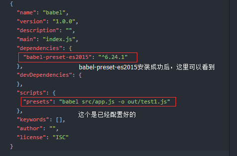

### Babel是的作用
是将ES6代码转为ES5代码的一个转码器。

以下是我测试的文件夹：

1. 在根目录里有个.babelrc的文件，它是babel的配置文件；
2. 在babelrc我的配置如下：

   babelrc文件里的语法格式是JSON格式,必须双引号！！！
3. 在presets写入es2015; 全称是：babel-preset-es2015

4. 接下来我们来安装es6需要转成es5的插件,命令如下：
     > npm install --save-dev babel-preset-es2015
      
     或
      
     npm i -D babel-preset-es2015

5. 接下来再执行:
    > npm init -y  &nbsp;&nbsp;(一步到位)
     
     或
     
    npm init  &nbsp;&nbsp;(安提示输入信息或一路回车键)

6. 这时在babel文件夹根目录多了一个package.json文件,打开可以看到如下：

7. "presets": "babel src/app.js -o out/test1.js" 这行代码的意思是：
      - presets是运行的命令
      - src文件夹下的app.js，-o是输出， 到out文件夹下的test1.js文件里

8. src/app.js文件里写的es6语法,如下图：

9. 执行：
     >  npm run presets

10. 再打开out/test1.js，如下图：

  
  
  上图就是es6转码的es5。
